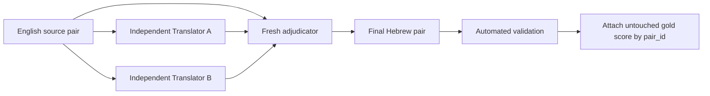

# Hebrew STS-B Translation

This document describes the Hebrew translation of the **Semantic Textual
Similarity Benchmark (STS-B)** used in the Hebrew Negation Embeddings project.
It records the source dataset, translation and adjudication procedure,
experimental use, limitations, attribution requirements, and licensing notes.

> **Important:** This is a translated version of English STS-B. It is not an
> independently human-annotated Hebrew STS benchmark. The Hebrew sentences
> inherit the original English similarity scores only after translation and
> adjudication are complete.

## What is STS-B?

[STS-B](https://ixa2.si.ehu.eus/stswiki/) is a standard benchmark for measuring
whether a model can estimate the semantic similarity of two sentences. Its
original language is **English**.

Each record contains:

- Two English sentences.
- A human similarity score between `0` and `5`.
- Source and genre metadata.
- An official `train`, `dev`, or `test` assignment.

The score scale is interpreted approximately as follows:

- `0`: unrelated meanings.
- `1`–`4`: increasing degrees of partial semantic similarity.
- `5`: effectively equivalent meanings.

The sentences come mainly from news headlines, image or video captions, and
online forums. STS-B was assembled from English STS shared-task data collected
between 2012 and 2017 so that semantic-representation systems could be compared
under a common evaluation protocol.

The complete English benchmark contains:

| Split | Pairs |
|---|---:|
| Train | 5,749 |
| Development | 1,500 |
| Test | 1,379 |
| **Total** | **8,628** |

## Scope of the Hebrew translation

This project translates only the official development and test splits:

| Split | Pairs | Translation batches |
|---|---:|---|
| Development | 1,500 | Five batches of 300 |
| Test | 1,379 | Four batches of 300 and one batch of 179 |
| **Total** | **2,879** | **10 batches** |

The 5,749 training pairs are not translated because this project does not train
or fine-tune a model on STS-B.

The official split is preserved:

- `dev` is used during method development and as a semantic-quality guard when
  selecting hyperparameters such as lambda.
- `test` remains untouched until the final locked evaluation.

## Why the project uses STS-B

The main experiment tests whether sentence-embedding interventions become more
sensitive to Hebrew negation. A method that separates a sentence from its
negation but damages ordinary semantic similarity is not useful.

Hebrew STS-B is therefore a **trade-off guard**, not the headline dataset. The
final experiment compares model-produced similarity scores with the inherited
STS-B gold scores using:

- Pearson correlation.
- Spearman correlation.

STS-B is not used to train the embedding models. The final test split must not
influence translation decisions, hyperparameter selection, or model tuning.

## Source acquisition and integrity

The canonical STS-B archive is:

`http://ixa2.si.ehu.es/stswiki/images/4/48/Stsbenchmark.tar.gz`

When the canonical host returned HTTP 403, a byte-identical
[Internet Archive snapshot](https://web.archive.org/web/20220101000000id_/http://ixa2.si.ehu.es/stswiki/images/4/48/Stsbenchmark.tar.gz)
was used. The downloaded archive was verified against the published checksum:

- MD5: `4eb0065aba063ef77873d3a9c8088811`
- SHA-256: `557a86abbd2b76ee6768d8b5103b659601a9d26b797898c7467812f303b21280`

Original row order, split assignments, pair IDs, source metadata, English text,
and gold scores are preserved.

## Translation and adjudication pipeline

Each pair is processed by **two independent LLM translators and one independent
LLM adjudicator**.



### 1. Score-blind inputs

Translator input contains exactly:

```json
{
  "pair_id": "stsb-dev-000001",
  "sentence1_en": "A man with a hard hat is dancing.",
  "sentence2_en": "A man wearing a hard hat is dancing."
}
```

Gold scores, model predictions, labels, and private metadata are stored
separately. Translators and adjudicators never see them.

### 2. Two independent translations

Translator A and Translator B work in separate, context-isolated agent runs.
Neither translator may inspect the other candidate. Each translates both
sentences faithfully while preserving:

- Meaning and truth conditions.
- Negation, polarity, and scope.
- Modality, uncertainty, and conditionals.
- Quantifiers and their scope.
- Tense, aspect, comparisons, and argument roles.
- Numbers, dates, percentages, currencies, and units.
- Named entities, pronouns, and coreference.
- Ambiguity, idioms, register, and meaningful lexical distinctions.

The paired sentence may be used to maintain consistent terminology, but the
translator must not make the two sentences artificially more similar.

Each candidate row contains only:

```json
{
  "pair_id": "stsb-dev-000001",
  "sentence1_he": "...",
  "sentence2_he": "..."
}
```

### 3. Independent adjudication

A fresh adjudicator receives the English source pair and both Hebrew candidates.
The adjudicator was not a translator for that batch and does not see the gold
score.

For each sentence, it selects one of:

- `A`: use Translator A exactly.
- `B`: use Translator B exactly.
- `MERGED`: combine correct elements from both candidates.
- `CORRECTED`: create a faithful correction from the English source because
  neither candidate is adequate.

The adjudicator first checks each sentence independently and then verifies that
the final Hebrew pair preserves the semantic relationship of the English pair.
Special attention is given to negation, modality, quantifiers, tense, argument
roles, numbers, entities, ambiguity, omissions, additions, pair collapse, and
loss or addition of contrast.

Low-confidence, malformed-source, unresolved-ambiguity, and other uncertain
cases are marked with `requires_human_review=true`; they are not silently fixed.

### 4. Context and batch controls

- Every agent receives a fresh context and exactly one role for one batch.
- Agents are not reused for another batch or role.
- Each batch is saved and checked in groups of 25 pairs.
- Every output must preserve the exact source ID order.
- Missing or invalid rows are retried individually; validated rows are not
  regenerated.

### 5. Automated validation

Every candidate and adjudicated file is checked for:

- Expected row count.
- Exact ordered ID match with its source batch.
- Unique IDs and valid JSONL.
- Exact required schema.
- Nonempty Hebrew sentences containing Hebrew characters.
- Allowed decision, issue-code, and confidence values.
- Exact candidate equality when the adjudicator chooses `A` or `B`.
- Required notes for merged, corrected, low-confidence, or human-review rows.
- Absence of gold scores, labels, or model predictions.

### 6. Final score attachment

Only after adjudication and validation are complete are the original scores
joined back by exact `pair_id`. Scores are copied without recalculation or
modification.

If translation changes a meaning, the translation is corrected or flagged. The
gold score is never changed merely to fit a translation.

## Recommended final data format

Every final evaluation row should keep the English source, Hebrew translation,
score, split, and provenance together:

```json
{
  "pair_id": "stsb-dev-000001",
  "split": "dev",
  "genre": "main-captions",
  "source": "MSRvid",
  "source_pair_id": "0000",
  "sentence1_en": "A man with a hard hat is dancing.",
  "sentence2_en": "A man wearing a hard hat is dancing.",
  "sentence1_he": "גבר עם קסדת מגן רוקד.",
  "sentence2_he": "גבר החובש קסדת מגן רוקד.",
  "gold_score": 5.0,
  "sentence1_provenance": null,
  "sentence2_provenance": null
}
```

Recommended final files:

- `hebrew_stsb_dev.jsonl`: exactly 1,500 rows.
- `hebrew_stsb_test.jsonl`: exactly 1,379 rows.
- `hebrew_stsb_all.jsonl`: optional combined archival file with 2,879 rows and
  the official `split` field preserved.

## Are the inherited English scores valid in Hebrew?

Using the original English score after translation is a practical and commonly
used approximation, but it is **not a perfect assumption**.

Translation can change the appropriate similarity judgment. For example:

- Two distinctions in English may collapse into one Hebrew formulation.
- Translation may resolve an ambiguity that was present in English.
- Negation, tense, gender, modality, or quantifier scope may change.
- An idiom or lexical distinction may not have an equivalent Hebrew form.
- An error in only one sentence may change the relationship of the pair.

The two-translator-plus-adjudicator pipeline substantially reduces translation
errors, but it does not turn the inherited scores into native Hebrew human
annotations.

A translated Swedish STS-B study reported translation errors and vocabulary
artifacts, while also concluding that translated STS-B can still be useful for
comparing suitable models when it is not treated as downstream training data:
[Isbister and Sahlgren, 2020](https://arxiv.org/abs/2009.03116).

This limitation is acceptable for the present project because STS is a
secondary semantic-quality guard rather than the main experimental result. It
must nevertheless be disclosed in the report.

### Recommended Hebrew-label validation

Before final model evaluation, validate the inherited-score assumption on a
stratified sample of approximately 300 pairs:

1. Cover both official splits, all genres, and the full `0`–`5` score range.
2. Include translation rows marked uncertain, materially corrected, or
   containing negation.
3. Ask at least two native Hebrew speakers to score the Hebrew pairs
   independently from `0` to `5` without seeing the English gold scores or model
   predictions.
4. Compare the Hebrew ratings with the inherited English scores using
   correlation, mean absolute difference, and annotator agreement.
5. If agreement is strong, retain the original scores and report the validation.
   If it is weak, revise the affected translations and consider broader native
   Hebrew annotation before treating the dataset as a benchmark.

The final resource should be described as **a quality-controlled Hebrew
translation of STS-B with inherited English gold scores**, not as a natively
annotated Hebrew STS dataset.

## Citation and attribution

Research using this data should cite the STS website and the SemEval-2017 Task 1
paper:

> Daniel Cer, Mona Diab, Eneko Agirre, Iñigo Lopez-Gazpio, and Lucia Specia.
> 2017. SemEval-2017 Task 1: Semantic Textual Similarity — Multilingual and
> Cross-lingual Focused Evaluation. Proceedings of SemEval-2017.

- Paper: https://aclanthology.org/S17-2001/
- STS website: https://ixa2.si.ehu.eus/stswiki/

```bibtex
@inproceedings{cer-etal-2017-semeval,
  title     = {SemEval-2017 Task 1: Semantic Textual Similarity --
               Multilingual and Cross-lingual Focused Evaluation},
  author    = {Cer, Daniel and Diab, Mona and Agirre, Eneko and
               Lopez-Gazpio, I\~nigo and Specia, Lucia},
  booktitle = {Proceedings of the 11th International Workshop on Semantic
               Evaluation (SemEval-2017)},
  year      = {2017},
  publisher = {Association for Computational Linguistics},
  doi       = {10.18653/v1/S17-2001}
}
```

## Licenses and source-specific obligations

STS-B does not have one blanket license covering all of its contents.

### Gold scores

The similarity scores are released under
[Creative Commons Attribution-ShareAlike 4.0 International](https://creativecommons.org/licenses/by-sa/4.0/).
Attribution and ShareAlike obligations apply when the scores or adaptations are
redistributed.

### Sentence text

The sentence text retains the license and attribution requirements of its
original source:

| STS source | Relevant obligation |
|---|---|
| `MSRpar` | Users must agree to the Microsoft Research Paraphrase Corpus license terms. |
| `MSRvid` | Users must agree to the Microsoft Research Video Description Corpus license terms. |
| `headlines` | Content was mined from European Media Monitor feeds; acknowledge EMM and follow its legal notice. |
| `deft-news` | Originates from the DEFT project; verify its applicable terms separately before redistribution. |
| `images` | Image descriptions derive from PASCAL VOC-2008 material; the supplied STS notes identify a Creative Commons Attribution-ShareAlike basis for the captions. |
| `track5.en-en` | Derived from SNLI and identified as CC BY-SA 4.0. |
| `answers-answers` | Stack Exchange user content under CC BY-SA 3.0 with source, author, question, and profile attribution requirements. |
| `answers-forums` | Stack Exchange user content under CC BY-SA 3.0; redistribution must preserve the supplied license and attribution information. |

Because translation is generally an adaptation, publishing the Hebrew text may
trigger the attribution and ShareAlike conditions of the corresponding source.
Do not label the complete translated dataset with a single license unless every
component's terms have been checked and found compatible.

To preserve attribution capability, final rows should retain `source`,
`source_pair_id`, and any available sentence-level provenance fields. The
dataset documentation should include a source-to-license mapping and all
required notices.

This section summarizes the license notes distributed with STS-B and is not
legal advice. Microsoft, DEFT, Stack Exchange, and other source-specific terms
should be reviewed before publicly redistributing the English or translated
sentence text.

## Reproducibility and reporting checklist

When reporting results based on this resource:

- State that the original language is English.
- State that Hebrew sentences were produced by two independent LLM translations
  followed by independent LLM adjudication.
- State that original English scores were inherited unchanged.
- Report any human validation of the inherited-score assumption.
- Keep development and test results separate.
- Report Pearson and Spearman correlations.
- Do not imply that the Hebrew scores were independently human-annotated.
- Cite STS-B, SemEval-2017 Task 1, and relevant component sources.
- Preserve and disclose source-specific licensing limitations.
